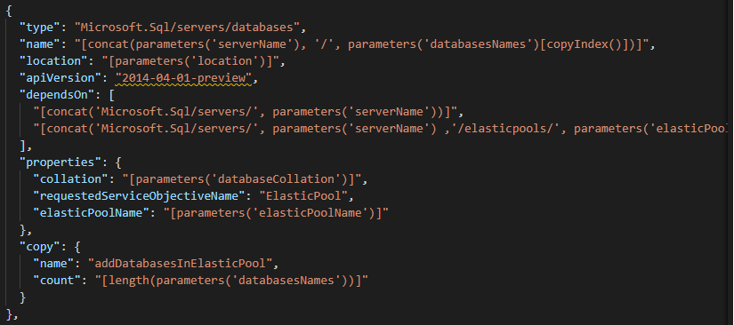
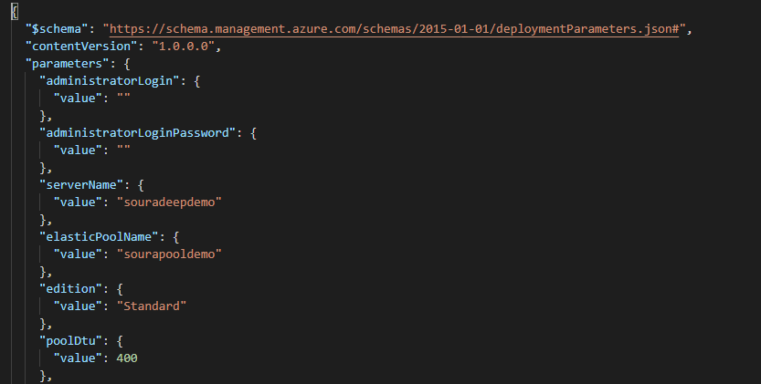

# ARM Template Deployment of Azure SQL Databases in a Elastic Pool and CosmosDB using Azure Storage Explorer

## ARM - Azure Resource Manager Templates
ARM Templates can be used to deploy a whole resource group containing different resources or deploy some specific resources in a resource group in 'incremental' or 'complete' mode. In this demo we are going to showcase 'incremental' template deployment. 

## Template for Azure SQL Database
Now we are going to take a look at the template for deploying the Azure SQL Database. Azure SQL database is a Platform as a Service or PaaS offering of Microsoft Cloud PLatform. It has many built in functions such as upgrading, backup, managment and monitoring. It also supports Elastic Pool support for managing and scaling databases having unforseen usage demands.

<p align="center">
</br>
Figure 1.1: Snippet of SQL Database Template 
</p>

We are also going to use a parmeter file to provide values to this template while deployment. We can change the values of the parameters by changing the values inside the file or in the portal itself, while doing a custom deployment. 

<p align="center">
</br>
Figure 1.1: Snippet of SQL Database Template parameter file 
</p>

## Deployment
We will use the Windows Powershell inorder to perform the deployment of the Azure Template. Windows PowerShell is a cross-platform task automation and configuration management framework, consisting of a command-line shell and scripting language. Powershell i s built on top of the .NET Common Language Runtime (CLR) and accepts and returns .NET objects.
<p align="center">
</br>
Figure 1.1: Windows Powershell
</p>
At first we are going to test the template with the parameters file before actually deploying. For that we are going to use the command:

```bash
Test-AzResourceGroupDeployment -ResourceGroupName "rsg-SQL-demo" -TemplateFile azuredeploy.json -Mode incremental -TemplateParameterFile parameters.json
```

After the Validation is complete we are going to actually deploy the template in Azure using the following commmand:

```bash
New-AzResourceGroupDeployment -ResourceGroupName "rsg-SQL-demo" -TemplateFile azuredeploy.json -Mode incremental -TemplateParameterFile parameters.json
```