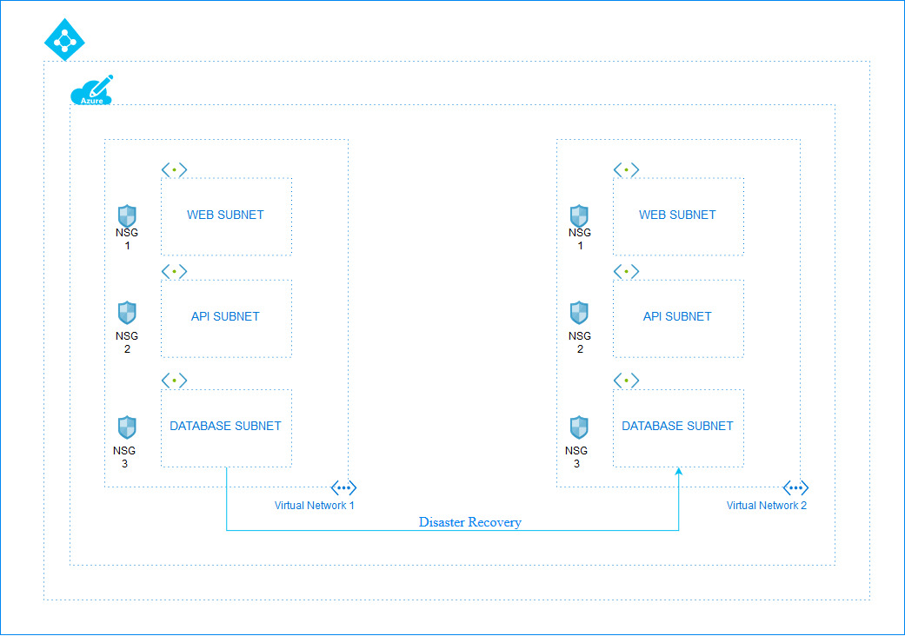

# Nested Deployment for Creation of Vnet, Subnets, NSGs and Peering

WEB-API-DATABSE architecture is a three-tier architecture which is the basic model for developing a web database application and communication is done using this 3-level application logic.</br> 
At the base of the model lies the database tier where data gets stored in a database server and various CRUD operations are being performed here. Above the database tier lies the middle tier which contains the application logic and does all the communication between the user and the database. Lastly on the top lies the web tier which is the web client that is used to interact with the user. User puts their request through the web tier, which gets processed by the middle tier and accordingly operations are being performed on the data base tier.</br>


This template creates a Vnet with 3 subnets. Along with the subnets there will be 3 network security groups created with the rules predefined in the template file for WEB-API-DATBASE architecture. These 3 security groups will be assosciated with each of the subnets respectively. After that the Vnets created will be peered automatically by the template.You can use the parameter.json file in order to use the default values for the template deployment.</br>

<p align="center">
</br>
Figure 1.1: Working of the Architecture 
</br></br>

Figure 1.2: Detailed Architecture in Azure

</p>


</br>
In case of disaster recovery the bash script may be executed on the database nsg to allow communication to the second Vnet's Database subnet.</br>

## Four Modes of Execution:<br/>
### 1. Using Deploy Button:
 <a href="https://portal.azure.com/#create/Microsoft.Template/uri/https%3A%2F%2Fraw.githubusercontent.com%2FSouradeep2304%2FAzure-Templates%2Fmaster%2FNested%20Templates%2FCreation%20of%20Two%20Vnets%20and%20peering%2Fmain.json" target="_blank">
    
</a>
<a href="https://portal.azure.com/#create/Microsoft.Template/uri/https%3A%2F%2Fraw.githubusercontent.com%2FSouradeep2304%2FAzure-Templates%2Fmaster%2FNested%20Templates%2FCreation%20of%20Two%20Vnets%20and%20peering%2Fmain.json" target="_blank">
    
</a><br/>
You can press on the deploy button above inorder to directly deploy this ARM template on Azure portal.<br/>

### 2. Azure CLI:
<a href="https://shell.azure.com" target="_blank">
 
</a></br>

You can use Azure CLI in order to deploy the template using the command:
```bash
az group deployment create --resource-group <resource-group-name> --template-file main.json
```
Before execuing the command you have to upload the main.json file through the upload option given in the Azure CLI portal. Also replace the resource-group-name with your resource group.<br/>

### 3. Azure PowerShell:
<a href="https://shell.azure.com" target="_blank">
 
</a></br>
 You can click on the above button to run Azure PoweShell in order to deploy the template using the command:
 
```bash
New-AzResourceGroupDeployment -ResourceGroupName <resource-group-name> -TemplateFile main.json
``` 
Before using the powershell command do remember to upload the file using the upload option and then change to home directory. Also replace the resource-group-name with your resource group.

### 4. Terraform:
<a href="https://shell.azure.com" target="_blank">
 
</a></br>

Use the TEMPLATE1.tf file inorder to do the deployment using terraform. Change the values of the parameters in the parameters section according to need. Remember to upload the main.json file to the directory before executing the commands for terraform. After uploading the file and [`configuring Terraform`](https://docs.microsoft.com/en-us/azure/virtual-machines/linux/terraform-install-configure), use the following sequence of commands:
 - ```terraform init ```
 - ```terraform plan ``` 
 - ```terraform apply```
